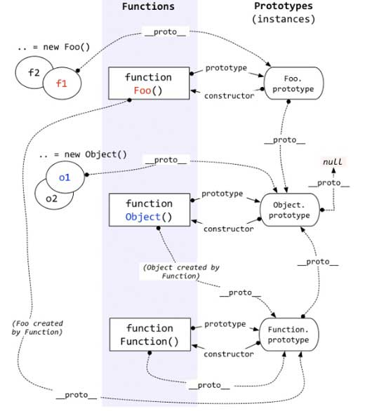

## 概述
JavaScript 提供了一个内部数据结构，用来表述对象的属性，控制它的行为。每个属性都有自己对应的属性描述对象，保存该属性的一些元信息。
下面是属性描述对象的一个例子。
<!--more-->
```JavaScript
{
  configurable:true,
  enumerable:true,
  value:1,
  writable:true,
  __proto__:Object, // 可称为隐式原型 一个对象实例通过内部属性[[Prototype]]跟踪其原型对象。
  get:undefined,
  set:undefined
}
```
在JS里，万物皆对象。方法（Function）是对象，方法的原型(Function.prototype)是对象。因此，它们都会具有对象共有的特点。
即：对象具有属性`__proto__`，可称为隐式原型，一个对象的隐式原型指向构造该对象的构造函数的原型，这也保证了实例能够访问在构造函数原型中定义的属性和方法。
方法这个特殊的对象，除了和其他对象一样有上述`_proto_`属性之外，还有自己特有的属性——原型属性（`prototype`），这个属性是一个指针，指向一个对象，这个对象的用途就是包含所有实例共享的属性和方法（我们把这个对象叫做原型对象）。原型对象也有一个属性，叫做`constructor`，这个属性包含了一个指针，指回原构造函数。
具体如下图所示:

上图表述：
1. 构造函数Foo()
构造函数的原型属性Foo.prototype指向了原型对象，在原型对象里有共有的方法，所有构造函数声明的实例（这里是f1，f2）都可以共享这个方法。

2. 原型对象Foo.prototype
Foo.prototype保存着实例共享的方法，有一个指针constructor指回构造函数。

3. 实例
f1和f2是Foo这个对象的两个实例，这两个对象也有属性__proto__，指向构造函数的原型对象，这样子就可以像上面1所说的访问原型对象的所有方法啦。

4. Foo()除了是方法，也是对象啊，它也有__proto__属性，指向谁呢？
指向它的构造函数的原型对象呗。函数的构造函数不就是Function嘛，因此这里的__proto__指向了Function.prototype。
其实除了Foo()，Function(), Object()也是一样的道理。

5. 原型对象也是对象啊，它的__proto__属性，又指向谁呢？
同理，指向它的构造函数的原型对象呗。这里是Object.prototype.

6. 最后，Object.prototype的__proto__属性指向null。

## 属性描述对象6个元属性
* **value**： 该属性的属性值
* **writable**：表示属性值（`value`）是否可改变（即是否可写），默认为`true`。
* **enumerable**：布尔值，表示该属性是否可遍历，默认为`true`。如果设为`false`，会使得某些操作（比如`for...in`循环、`Object.keys()`）跳过该属性。
* **configurable**：布尔值，表示可配置性，默认为`true`。如果设为`false`，将阻止某些操作改写该属性，比如无法删除该属性，也不得改变该属性的属性描述对象（value属性除外）。也就是说，`configurable`属性控制了属性描述对象的可写性。
* **get**：函数，表示该属性的取值函数（getter），默认为`undefined`
* **set**：函数，表示该属性的存值函数（setter），默认为`undefined`。

### 描述符可同时具有的键值

|          | configurable | enumerable | value | writable | get | set |
|----------|:------------:|:----------:|:-----:|:--------:|:---:|:---:|
| 数据描述符| yes | yes | yes | yes | no | no |
| 存取描述符| yes | yes | no | no | yes | yes |
## Object.getOwnPropertyDescriptor()
`Object.getOwnPropertyDescriptor`方法可以获取属性描述对象。它的第一个参数是一个对象，第二个参数是一个字符串，对应该对象的某个属性名。注意，Object.getOwnPropertyDescriptor方法只能用于对象自身的属性，不能用于继承的属性。
```JavaScript
  var obj = { p: 'a' };

  Object.getOwnPropertyDescriptor(obj, 'p')
  // Object { value: "a",
  //   writable: true,
  //   enumerable: true,
  //   configurable: true
  // }
```

## Object.getOwnPropertyNames()
`Object.getOwnPropertyNames`方法返回一个数组，成员是参数对象自身的全部属性的属性名，不管该属性是否可遍历。

## Object.defineProperty()，Object.defineProperties()
`Object.defineProperty(object, propertyName, attributesObject)`
* `object`：属性所在的对象
* `propertyName`：属性名（它应该是一个字符串）
* `attributesObject`：属性描述对象

```JavaScript
  var obj = Object.defineProperty({}, 'p', {
    value: 123,
    writable: false,
    enumerable: true,
    configurable: false
  });

  obj.p // 123

  obj.p = 246;
  obj.p // 123
```
如果一次性定义或修改多个属性，可以使用Object.defineProperties方法。
```JavaScript
  var obj = Object.defineProperties({}, {
    p1: { value: 123, enumerable: true },
    p2: { value: 'abc', enumerable: true },
    p3: { get: function () { return this.p1 + this.p2 },
      enumerable:true,
      configurable:true
    }
  });

  obj.p1 // 123
  obj.p2 // "abc"
  obj.p3 // "123abc"
```
## Object.prototype.propertyIsEnumerable()
实例对象的propertyIsEnumerable方法返回一个布尔值，用来判断某个属性是否可遍历。
```JavaScript
  var obj = {};
  obj.p = 123;

  obj.propertyIsEnumerable('p') // true
  obj.propertyIsEnumerable('toString') // false
```

## 原属性
### value
`value` 目标属性的值
```JavaScript
var obj = {};
obj.p = 123;

Object.getOwnPropertyDescriptor(obj, 'p').value
// 123

Object.defineProperty(obj, 'p', { value: 246 });
obj.p // 246
```
### writable
`writable`属性是一个布尔值，决定了目标属性的值（value）是否可以被改变。注意：严格模式下，`writable`为`false`的属性赋值会报错。
```JavaScript
  var obj = {};

  Object.defineProperty(obj, 'a', {
    value: 37,
    writable: false
  });

  obj.a // 37
  obj.a = 25;
  obj.a // 37
```
如果原型对象的某个属性的writable为false，那么子对象将无法自定义这个属性。
```JavaScript
  var proto = Object.defineProperty({}, 'foo', {
    value: 'a',
    writable: false
  });
  
  var obj = Object.create(proto);

  obj.foo = 'b';
  obj.foo // 'a'
```
上面代码中，proto是原型对象，它的foo属性不可写。obj对象继承proto，也不可以再自定义这个属性了。如果是严格模式，这样做还会抛出一个错误。

但是，有一个规避方法，就是通过覆盖属性描述对象，绕过这个限制。原因是这种情况下，原型链会被完全忽视。
```JavaScript
  var proto = Object.defineProperty({}, 'foo', {
    value: 'a',
    writable: false
  });

  var obj = Object.create(proto);
  Object.defineProperty(obj, 'foo', {
    value: 'b'
  });

  obj.foo // "b"
```
### enumerable
`enumerable`（可遍历性）返回一个布尔值，表示目标属性是否可遍历。
具体来说，如果一个属性的enumerable为false，下面三个操作不会取到该属性。
* for..in循环
* Object.keys方法
* JSON.stringify方法

因此，enumerable可以用来设置“秘密”属性。
```JavaScript
  var obj = {};
  Object.defineProperty(obj, 'x', {
    value: 123,
    enumerable: false
  });
  obj.x // 123
  
  for (var key in obj) {
    console.log(key);
  }
  // undefined

  Object.keys(obj)  // []
  JSON.stringify(obj) // "{}"
```
### configurable
`configurable`(可配置性）返回一个布尔值，决定了是否可以修改属性描述对象。
```JavaScript
  var obj = Object.defineProperty({}, 'p', {
    value: 1,
    writable: false,
    enumerable: false,
    configurable: false
  });

  Object.defineProperty(obj, 'p', {value: 2})
  // TypeError: Cannot redefine property: p
  // 只要`writable`和`configurable`有一个为true，就允许改动value。

  Object.defineProperty(obj, 'p', {writable: true})
  // TypeError: Cannot redefine property: p

  Object.defineProperty(obj, 'p', {enumerable: true})
  // TypeError: Cannot redefine property: p

  Object.defineProperty(obj, 'p', {configurable: true})
  // TypeError: Cannot redefine property: p
```
注意，**writable**只有在`false`改为`true`会报错，`true`改为`false`是允许的。
至于**value**，只要`writable`和`configurable`有一个为true，就允许改动。
另外，configurable为false时，直接目标属性赋值，不报错，但不会成功。

### setter，getter
取值函数get不能接受参数，存值函数set只能接受一个参数（即属性的值。存取器往往用于，属性的值依赖对象内部数据的场合。
```JavaScript
  var obj = Object.defineProperty({}, 'p', {
    get: function () {
      return 'getter';
    },
    set: function (value) {
      console.log('setter: ' + value);
    }
  });
  obj.p // "getter"
  obj.p = 123 // "setter: 123"

  // es6 写法
  var obj = {
    get p() {
      return 'getter';
    },
    set p(value) {
      console.log('setter: ' + value);
    }
  };

  var obj ={
    $n : 5,
    get next() { return this.$n++ },
    set next(n) {
      if (n >= this.$n) this.$n = n;
      else throw new Error('新的值必须大于当前值');
    }
  };
  obj.next // 5
  obj.next = 10;
  obj.next // 10
  obj.next = 5;
  // Uncaught Error: 新的值必须大于当前值
  // next属性的存值函数和取值函数，都依赖于内部属性$n
```
## 对象的拷贝
有时，我们需要将一个对象的所有属性，拷贝到另一个对象，可以用下面的方法实现。
```JavaScript
  var extend = function (to, from) {
    for (var property in from) {
      to[property] = from[property];
    }

    return to;
  }
```
上面这个方法的问题在于，如果遇到存取器定义的属性，会只拷贝值。
```JavaScript
  extend({}, {
    get a() { return 1 }
  })
  // {a: 1}
```
为了解决这个问题，我们可以通过Object.defineProperty方法来拷贝属性。
```JavaScript
  var extend = function (to, from) {
    for (var property in from) {
      //过滤掉继承的属性
      if (!from.hasOwnProperty(property)) continue;
      Object.defineProperty(
        to,
        property,
        Object.getOwnPropertyDescriptor(from, property)
      );
    }
    return to;
  }
  extend({}, { get a(){ return 1 } })
```
## 控制对象状态
有时需要冻结对象的读写状态，防止对象被改变。JavaScript 提供了三种冻结方法，最弱的一种是`Object.preventExtensions`，其次是`Object.seal`，最强的是`Object.freeze`。
### Object.preventExtensions()
Object.preventExtensions方法可以使得一个对象无法再添加新的属性。
### Object.isExtensible()
`Object.isExtensible`方法用于检查一个对象是否使用了`Object.preventExtensions`方法。也就是说，检查是否可以为一个对象添加属性。

### Object.seal()
`Object.seal`方法使得一个对象既无法添加新属性，也无法删除旧属性。
`Object.seal`实质是把属性描述对象的`configurable`属性设为`false`，因此属性描述对象不再能改变了。
`Object.seal`只是禁止新增或删除属性，并不影响修改某个属性的值(**writable还为true**)。
### Object.isSealed()
`Object.isSealed`方法用于检查一个对象是否使用了`Object.seal`方法。
这时，`Object.isExtensible`方法也返回`false`。

### Object.freeze()
`Object.freeze`方法可以使得一个对象无法添加新属性、无法删除旧属性、也无法改变属性的值，使得这个对象实际上变成了**常量**。
### Object.isFrozen()
使用`Object.freeze`方法以后，`Object.isSealed`将会返回`true`，`Object.isExtensible`返回`false`。
### 局限性
上面的三个方法锁定对象的可写性有一个漏洞：可以通过改变原型对象，来为对象增加属性。
```JavaScript
  var obj = new Object();
  Object.preventExtensions(obj);

  var proto = Object.getPrototypeOf(obj);
  proto.t = 'hello';
  obj.t
  // hello
```
另外一个局限是，如果属性值是对象，上面这些方法只能冻结属性指向的对象，而不能冻结对象本身的内容。
```JavaScript
  var obj = {
    foo: 1,
    bar: ['a', 'b']
  };
  Object.freeze(obj);

  obj.bar.push('c');
  obj.bar // ["a", "b", "c"]
```